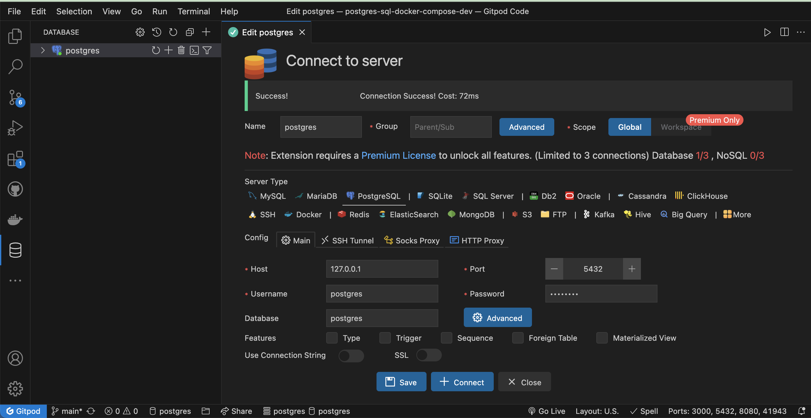
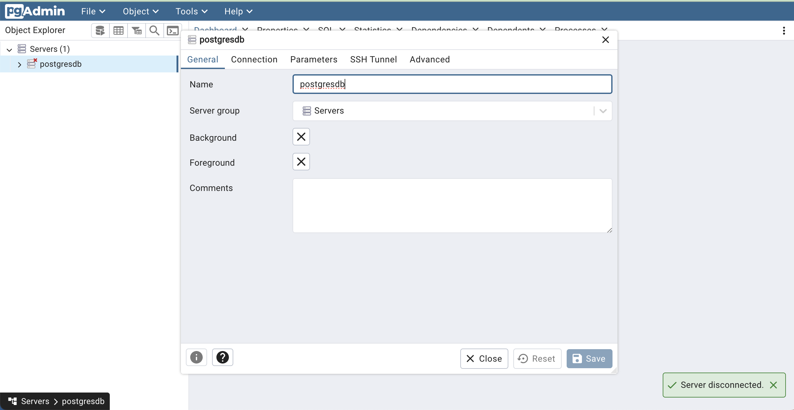
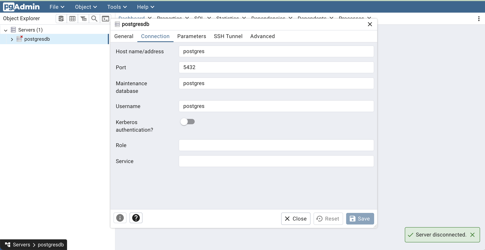

DB Connection properties

Default Configuration for docker compose is 
/workspaces/postgres-sql-docker-compose-dev/docker-compose-postgres-pgadmin4-adminer/docker-compose.yml
### Using Adminer:
server:postgres
username:postgres
password:postgres
database:postgres

